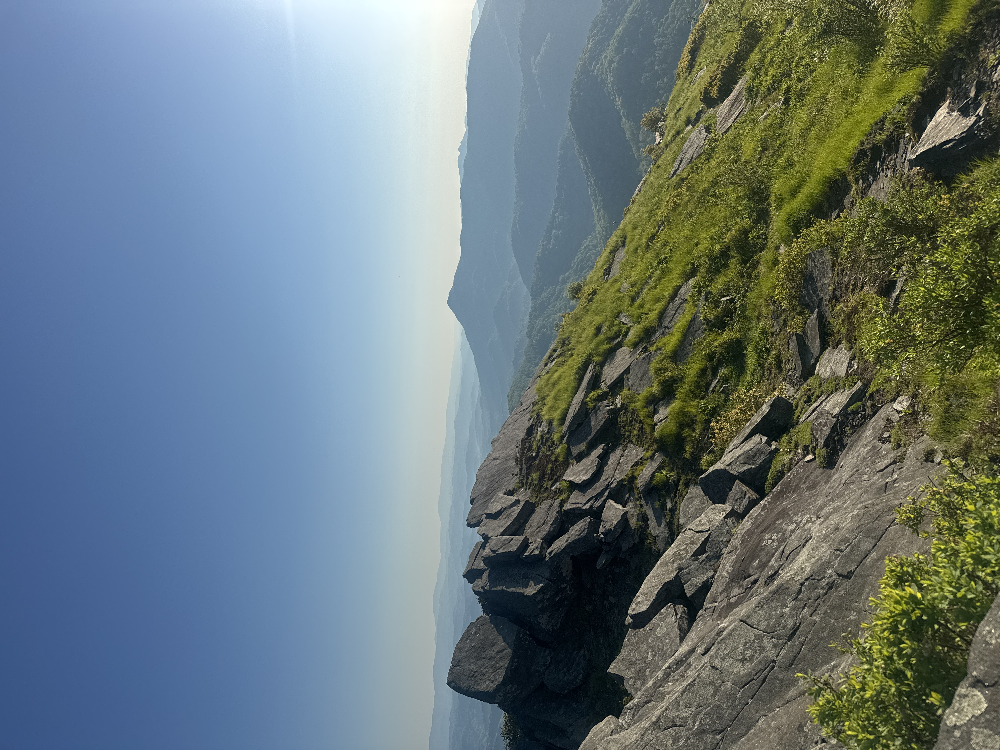

Megan Clarke
=

#### [Geography](geo.appstate.edu) Student, Appalachian State University.

##### _Boone, North Carolina, USA._ 

Expertise
--
* Human Geography
* Leadership and Management
* Cartography
* Documentary [Photography](https://www.instagram.com/mc.photography.21/) and Storytelling
* GIS Tools: ESRI, QGIS, R Studio and other mapping tools for data visualization, map design, and spatial analysis 
* Web Design: GitHub, Adobe Illistrator and Photoshop (for mapping and infografic creation)

Education 
--
_Bachelor's of General Science, Geography._ | Associate in Fine Arts. | _GIS certificate._ | Minor in Photography. 

Work Experience
--
#### Bartender, Server, Racket Sports Associate 
*Hound Ears Country Club, Boone, NC | 2024-present* 

#### Food Service Manager
*Chick-fil-a, Wesley Chapel, NC | 2020-2026*

#### Volleyball Coach 
*Carolina Courts, Indian Trail, NC | 2019-2025* 

#### Barista 
*Local Lion Cafe, Boone, NC | 2024-present* 

Volunteer Work 
--
###### Nine month global internship with *Campus Crusade for Christ (CRU).* Teaching English, coaching sports, and humanitarian aid. 